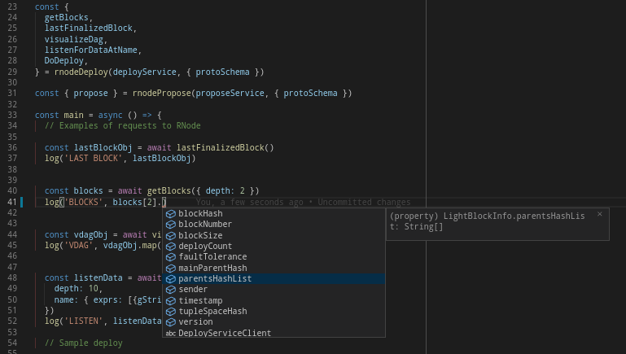

# RNode JS client examples

See also recording of code walk-thru:
 - [2020\-08\-25 RChain Education](https://www.youtube.com/watch?v=2EUd2vOiJX8)

## Web (HTTP)

In the browser connection to RNode can be done with **RNode Web API**. It's also possible to use gRPC with the proxy.  
Web API has only defined schema in Scala source, for the new info please check [RChain issue 2974](https://github.com/rchain/rchain/issues/2974).

<details>
<summary>Quick info to run Web example with two nodes</summary>

```sh
# Run nodes and web page example
npm install && docker-compose up -d && npm run start:web

# Logs from all nodes
docker-compose logs -f
```
</details>

Web example is published from `gh-pages` branch on this url [https://tgrospic.github.io/rnode-client-js](https://tgrospic.github.io/rnode-client-js).

## Nodejs (gRPC)

This repo contains examples how to use [**@tgrospic/rnode-grpc-js**](https://github.com/tgrospic/rnode-grpc-js) helper library to generate **RNode gRPC API** for **Nodejs**.

## Example of RNode connection to Metamask (with hardware wallet)

RNode has support for Ethereum type of signatures so Metamask can be used for signing deploys e.g. making transfers of REVs. In Web example, button to add selected Metamask account should be visible next to REV import textbox.

Helper functions are in [eth-wrapper.js](src/eth/eth-wrapper.js) which contains the code for communication with Metamask, getting selected ETH address and sending deploys for signing.
In [eth-sign.js](src/eth/eth-sign.js) are functions to verify deploy signature and to extract public key.  
This is all that is needed for communication with Metamask and also for connected hardware wallets (Ledger). How to use these functions and send deploys to RNode is in [rnode-web.js](src/rnode-web.js).

Changes on the web page are only saved in memory so it will be lost after refreshing the page.  
RChain networks available for selection are in [rchain-networks.js](src/rchain-networks.js) file.

## Install

Install project dependencies (in `./node_modules` folder).

```sh
# This is enough for HTTP connection to RNode and to run Web example
npm install
```

### Install (gRPC only)

Generate JS bindings (default in `./rnode-grpc-gen`).

```sh
# Defined as script command in package.json
npm run rnode-generate

# Or call executable script directly from npm bin folder
# - which is in the PATH when npm scripts are executed
node_modules/.bin/rnode-grpc
```

## Run **Web example** ([`src/web`](src/web))

This will start local Nodejs dev server in watch mode [http://localhost:1234](http://localhost:1234).

Test page contains a list of nodes to select, check balance, send transfers and deploys.

```sh
# Run web example
npm run start:web
```

## Run **Nodejs example** ([`src/nodejs/client.js`](src/nodejs/client.js))

In `src/nodejs/client.js` script is an example of how to connect to RNode from Nodejs.

```sh
# Run nodejs example / sample requests to RChain testnet
npm run start:nodejs
```

## Run RNode with Docker

In the project is [Docker compose](docker-compose.yml) configuration to run local RChain network.

```sh
# Starts validator and read-only RNode in daemon mode
docker-compose up -d

# Logs from all nodes
docker-compose logs -f
```

## Build static page (offline mode)

Web site can be compiled to static page which can be opened with double click on `index.html` in `./dist` directory where the page is built. This is exactly what we need for offline wallet. :)

Because it's a static page it can be published directly on Github via `gh-pages` branch which contains compiled files from `./dist` directory. It is visible on this url [https://tgrospic.github.io/rnode-client-js](https://tgrospic.github.io/rnode-client-js). If you fork this repo you can do this with you own version of app.  
With [GitHub pages action](.github/workflows/github-pages.yml) any commit to _master_ branch will rebuild and publish the page. Locally the page can be generated with _build_ command.

```sh
# Compile static web site (to ./dist folder)
npm run build:web
```

## TypeScript definitions (gRPC API)

`rnode-grpc-js` library also generates a TypeScript definition file that can be referenced in your code and can provide IntelliSense support in VSCode.

```typescript
/// <reference path="../../rnode-grpc-gen/js/rnode-grpc-js.d.ts" />
```


